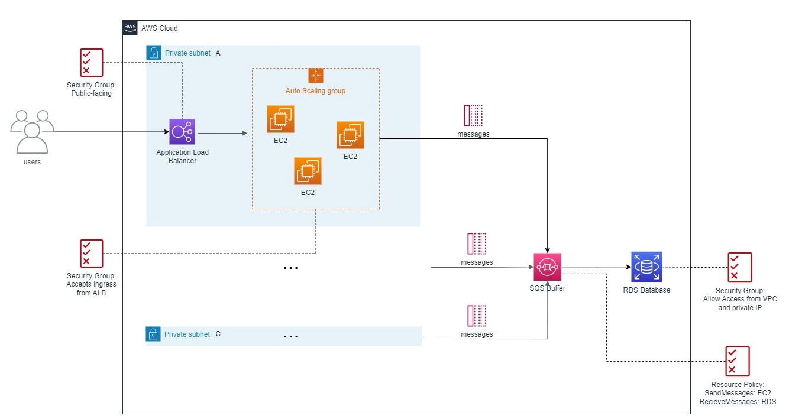

[](https://github.com/Kristina-Pianykh/terraform-aws-test-infrastructure/actions/workflows/tf-deploy.yml)

[](https://github.com/Kristina-Pianykh/terraform-aws-test-infrastructure/actions/workflows/tf-destroy.yml)

[](https://github.com/Kristina-Pianykh/terraform-aws-test-infrastructure/actions/workflows/tfsec.yml)

# Toy AWS Infrastructure with terraform

A simple setup for requesting a service that saves a request data to an Amazon RDS Database. The service is fronted with a public-facing Application Load Balancer that forwards a request to the service hosted on EC2 instances. The CPU load on the instances is regulated via an Autoscaling Group policy that spins up more EC2s if a threshold on average CPU utilization is exceeded. The request data is then encueued to an SQS buffer in the form of a message to prevent data loss in case the RDS Database is overloaded. The security policies ensure that messages are read by the RDS service only. The Database allows access for one local IP address for debugging purposes.


It's deployed via Github Workflows (on push) or locally with the `terraform_deploy.sh` script.

To destroy the infrastructure, trigger the workflow `Terraform Destroy` in the GitHub UI.

## To test the Autoscaling

- connect to an EC2 instance via AWS Console
- Install the stress testers with:

```bash
sudo amazon-linux-extras install epel -y
sudo yum install stress -y
```

- Run the stress tester with:

```bash
stress -c <cpu_cores>
```

## To run the main GitHub Workflow locally:

- install [`Docker`](https://docs.docker.com/get-docker/)
- install [`act`](https://github.com/nektos/act)

Run a Docker container with:

```bash
act -P ubuntu-latest=ghcr.io/catthehacker/ubuntu:full-latest --secret-file my.secrets --env-file aws.env -W .github/workflows/main.yml -e event.json
```

where

- `-P` is the Flag for an image
- `--secret-file` takes the path to the file with secrets
- `--env-file` takes the path to the file with environment variables
- `-W` takes the path to the workflow file
- `-e` takes the path to the event file (in this repo used to skip some jobs)
